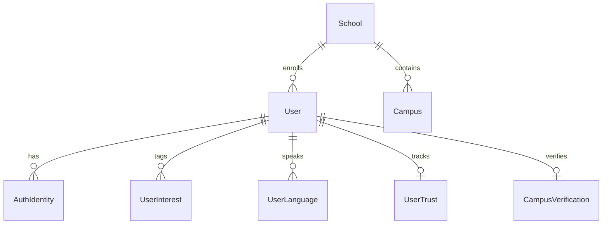
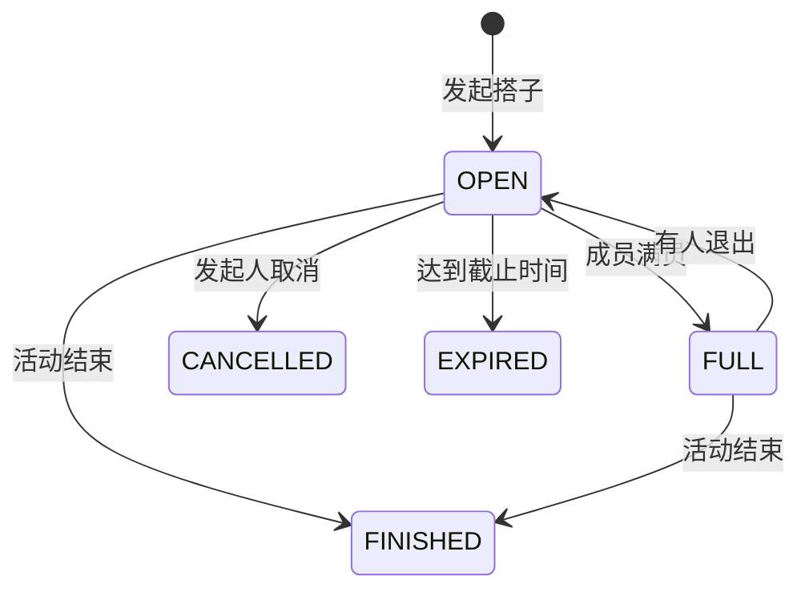

# 统一领域模型规范 (UNIFIED_DOMAIN_MODEL)

> 版本：v1.0.0-draft  
> 目标：为“校园便利盒 + Tongpin 同频 + UniBridge 友桥”构建唯一的全平台通用业务领域抽象。

---

## 1. 核心设计原则

1. **唯一主键约定 (Single Source of Identity)**：
   - 严禁未来使用 `userId`, `uid`, `openid`, `profileId`, `memberId` 交叉混用。
   - 所有业务表统一使用 `InternalUserId` (UUID v4 / 稳定自增规范)，作为系统内部的用户唯一主键。
   - 微信 `openid`、微信小程序 `unionid`、手机号、邮箱仅作为 `AuthIdentity` 的外部凭证，严禁作为业务外键。
2. **多租户与组织层级 (School & Campus)**：
   - 任何涉及校园维度的资源，必须挂载 `schoolId` 与可选的 `campusId`。
   - 允许支持单校运营（如桂林航天工业学院）平滑无缝拓展至多校多校区。
3. **高内聚子域划分**：
   - **Core Auth & User**：用户身份、认证、多语言、档案
   - **Campus Life & Market**：便利生活、二手集市、树洞贴文
   - **Tongpin Buddy**：搭子发布、报名、成局、信誉
   - **UniBridge Exchange**：语言搭子、跨文化活动、国际学生协同
   - **Universal Communication**：通用会话、通用私信/群聊消息、通知中心
   - **Trust & Safety**：实名/校园认证、拉黑、举报、内容风控

---

## 2. 核心领域实体定义

### 2.1 账户与身份域 (Identity & Access)



#### User (平台核心用户主表)
```typescript
interface User {
  id: string;                    // InternalUserId (UUID v4)
  numericId: string;             // 8位可读业务展示工号/学号展示ID
  nickname: string;              // 昵称
  avatarUrl: string;             // 头像地址
  gender: 'male' | 'female' | 'other' | 'undisclosed';
  schoolId: string;              // 归属学校ID (FK -> School.id)
  campusId?: string;             // 归属校区ID (FK -> Campus.id)
  studentType: 'chinese_student' | 'international_student' | 'alumni' | 'staff';
  role: 'user' | 'moderator' | 'admin';
  status: 'active' | 'muted' | 'banned' | 'deleted';
  banExpiry?: string | null;     // ISO8601
  createdAt: string;             // ISO8601
  updatedAt: string;             // ISO8601
}
```

#### AuthIdentity (多渠道登录认证)
```typescript
interface AuthIdentity {
  id: string;                    // 凭据记录ID
  userId: string;                // 关联核心用户 (FK -> User.id)
  provider: 'wechat_mini' | 'wechat_official' | 'phone' | 'email';
  providerKey: string;           // 微信openid / 微信unionid / 规范化手机号 / 邮箱
  credentialHash?: string;       // 密码哈希或授权凭据
  lastLoginAt: string;
  createdAt: string;
}
```

#### Profile (用户扩展档案)
```typescript
interface UserProfile {
  userId: string;                // FK -> User.id
  bio: string;                   // 个人简介
  mbti?: string;                 // MBTI 类型 (e.g. "INTJ")
  grade?: string;                // 年级 (e.g. "2024级")
  major?: string;                // 专业
  hometown?: string;             // 家乡 / 籍贯
  country?: string;              // 国籍 / 地区代码 (ISO 3166-1 alpha-2, e.g. "CN", "FR")
  purposes: string[];            // 社交目的: ["study", "language", "sports", "hangout"]
  exchangeMode?: 'offline' | 'online' | 'hybrid'; // 语言交换偏好
  availableTimes?: string[];     // 可空闲时段标签
  communicationPref?: 'wechat' | 'in_app' | 'offline';
  photos: string[];              // 展示图集
}
```

#### Language & UserLanguage (语言熟练度体系 - 赋能 UniBridge)
```typescript
interface Language {
  code: string;                  // ISO 639-1 (e.g. "zh", "en", "es", "ja", "fr")
  nameZh: string;                // 中文名称
  nameEn: string;                // 英文名称
}

interface UserLanguage {
  userId: string;                // FK -> User.id
  languageCode: string;          // FK -> Language.code
  proficiency: 'native' | 'fluent' | 'intermediate' | 'beginner';
  isLearning: boolean;           // 是否为正在学习的目标语言
}
```

#### Interest & UserInterest (兴趣图谱 - 赋能 Tongpin & 推荐)
```typescript
interface Interest {
  id: string;
  name: string;                  // e.g. "羽毛球", "摄影", "算法刷题", "吉他"
  category: 'sports' | 'study' | 'art' | 'game' | 'life';
  icon?: string;
}

interface UserInterest {
  userId: string;                // FK -> User.id
  interestId: string;            // FK -> Interest.id
}
```

---

### 2.2 校园生活与动态域 (Campus Life & Feed)

#### Post (校园贴文 / 树洞 / 问答)
```typescript
interface Post {
  id: string;
  authorId: string;              // FK -> User.id
  schoolId: string;
  campusId?: string;
  channel: 'treehole' | 'help' | 'academic' | 'lost_found' | 'general';
  title?: string;
  content: string;
  images: string[];
  isAnonymous: boolean;
  anonymousName?: string;        // 匿名代称 (如 "航天路小猫")
  isTop: boolean;
  viewCount: number;
  likeCount: number;
  commentCount: number;
  favorCount: number;
  status: 'active' | 'hidden' | 'deleted';
  createdAt: string;
}
```

#### Comment (通用评论)
```typescript
interface Comment {
  id: string;
  targetType: 'post' | 'market_goods' | 'event';
  targetId: string;
  authorId: string;              // FK -> User.id
  content: string;
  replyToCommentId?: string;
  replyToUserId?: string;
  likeCount: number;
  status: 'active' | 'hidden' | 'deleted';
  createdAt: string;
}
```

#### MarketItem (二手集市宝贝)
```typescript
interface MarketItem {
  id: string;
  sellerId: string;              // FK -> User.id
  schoolId: string;
  campusId?: string;
  category: string;              // 'digital' | 'books' | 'daily' | 'outfit' | 'tickets'
  title: string;
  description: string;
  price: number;                 // 人民币 (分)
  originalPrice?: number;
  images: string[];
  condition: 'brand_new' | 'like_new' | 'good' | 'fair';
  deliveryMode: 'self_pickup' | 'express' | 'campus_meet';
  status: 'active' | 'reserved' | 'sold' | 'offline' | 'deleted';
  wantCount: number;
  favorCount: number;
  viewCount: number;
  createdAt: string;
}
```

---

### 2.3 Tongpin 搭子核心领域 (Buddy Subsystem)



#### BuddyPost (搭子组局贴)
```typescript
interface BuddyPost {
  id: string;
  authorId: string;              // FK -> User.id
  schoolId: string;
  campusId?: string;
  category: 'meal' | 'sports' | 'study' | 'travel' | 'game' | 'entertainment';
  title: string;
  description: string;
  startAt: string;               // 活动开始时间 ISO8601
  endAt?: string;
  location: string;
  latitude?: number;
  longitude?: number;
  minPeople: number;             // 最少成行人数 (默认 2)
  maxPeople: number;             // 最大人数限制
  acceptedCount: number;         // 当前已通过人数
  genderRequirement: 'any' | 'male_only' | 'female_only';
  schoolOnly: boolean;           // 是否仅限本校
  status: 'OPEN' | 'FULL' | 'FINISHED' | 'CANCELLED' | 'EXPIRED';
  conversationId?: string;       // 成局后绑定的群聊 ID (FK -> Conversation.id)
  createdAt: string;
}
```

#### BuddyApplication (搭子申请单)
```typescript
interface BuddyApplication {
  id: string;
  postId: string;                // FK -> BuddyPost.id
  applicantId: string;           // FK -> User.id
  status: 'PENDING' | 'ACCEPTED' | 'REJECTED' | 'CANCELLED';
  applyMessage: string;
  createdAt: string;
  decidedAt?: string;
}
```

#### BuddyReview & UserTrust (搭子评价与信任体系)
```typescript
interface BuddyReview {
  id: string;
  buddyPostId: string;
  fromUserId: string;
  toUserId: string;
  rating: 1 | 2 | 3 | 4 | 5;
  tags: string[];                // ["准时到达", "友善好聊", "AA主动"] / ["放鸽子", "态度差"]
  comment?: string;
  createdAt: string;
}

interface UserTrust {
  userId: string;                // FK -> User.id
  score: number;                 // 默认 70，范围 [0, 100]
  completedEvents: number;       // 履约成功次数
  noShowCount: number;           // 爽约次数
  positiveFeedbackCount: number; // 好评次数
  reportPenaltyCount: number;    // 违规扣分次数
  updatedAt: string;
}
```

---

### 2.4 UniBridge 跨文化与通用活动域 (Events & Cultural Exchange)

#### Event (通用日程/活动)
```typescript
interface Event {
  id: string;
  creatorId: string;             // FK -> User.id
  schoolId: string;
  campusId?: string;
  eventType: 'campus_official' | 'cultural_exchange' | 'academic_workshop' | 'buddy_gathering';
  title: string;
  titleEn?: string;              // 英文双语标题
  description: string;
  descriptionEn?: string;        // 英文双语详情
  coverImage?: string;
  startAt: string;
  endAt: string;
  location: string;
  maxParticipants: number;
  currentParticipants: number;
  languages: string[];           // ["zh", "en"]
  requiresApproval: boolean;
  status: 'published' | 'ongoing' | 'completed' | 'cancelled';
  conversationId?: string;       // 活动群聊会话
  createdAt: string;
}

interface EventMember {
  eventId: string;               // FK -> Event.id
  userId: string;                // FK -> User.id
  role: 'organizer' | 'member';
  status: 'pending' | 'confirmed' | 'rejected' | 'checked_in';
  joinedAt: string;
}
```

---

### 2.5 通用会话与即时消息体系 (Universal Messaging)

所有业务（二手交易私聊、搭子小队群聊、语言交换 1v1、活动集体群聊）统一采用此模型：

```typescript
type ConversationType = 'DIRECT' | 'GROUP';
type ConversationContextType = 
  | 'DIRECT'            // 普通用户私聊
  | 'BUDDY'             // Tongpin 搭子局群聊
  | 'MARKET'            // 二手集市咨询 (关联 goodsId)
  | 'EVENT'             // 活动大群 (关联 eventId)
  | 'LANGUAGE_EXCHANGE';// UniBridge 语言搭子配对

interface Conversation {
  id: string;                    // UUID
  type: ConversationType;
  contextType: ConversationContextType;
  contextId?: string;            // 业务关联ID (goodsId / buddyPostId / eventId 等)
  title?: string;                // 群聊名称或自动派生
  lastMessageContent?: string;
  lastMessageAt?: string;
  createdAt: string;
  updatedAt: string;
}

interface ConversationMember {
  conversationId: string;        // FK -> Conversation.id
  userId: string;                // FK -> User.id
  role: 'owner' | 'admin' | 'member';
  lastReadAt?: string;           // 消息已读水位标
  joinedAt: string;
}

interface Message {
  id: string;
  conversationId: string;        // FK -> Conversation.id
  senderId: string;              // FK -> User.id
  type: 'text' | 'image' | 'card' | 'system';
  content: string;               // 纯文本或富载荷 JSON 串
  cardPayload?: {
    type: 'post' | 'goods' | 'buddy' | 'event';
    id: string;
    title: string;
    image?: string;
    price?: number;
  };
  createdAt: string;
}
```

---

### 2.6 安全、风控与关系实体 (Safety & Social Graph)

```typescript
interface UserBlock {
  blockerId: string;             // FK -> User.id
  blockedId: string;             // FK -> User.id
  createdAt: string;
}

interface UserReport {
  id: string;
  reporterId: string;            // FK -> User.id
  targetType: 'user' | 'post' | 'comment' | 'goods' | 'buddy' | 'message';
  targetId: string;
  reason: string;
  evidenceImages: string[];
  status: 'pending' | 'reviewing' | 'resolved' | 'dismissed';
  actionTaken?: string;          // 处置结果说明
  resolvedAt?: string;
  createdAt: string;
}

interface CampusVerification {
  userId: string;                // FK -> User.id
  schoolId: string;
  campusId?: string;
  realName?: string;
  studentNumber?: string;
  status: 'unverified' | 'pending' | 'verified' | 'rejected';
  method: 'edu_email' | 'student_card' | 'alumni_code' | 'manual';
  verifiedAt?: string;
}
```

---

## 3. 数据层适配原则

1. **过渡阶段 (Phase 0 - 2)**：
   - 维持微信云开发 NoSQL 物理存储，但在 Node.js / 云函数代码层严格封装为以上 Domain 规范实体。
   - 微信 `_openid` 在入库和出库时均由适配器转换为 `InternalUserId`。
2. **终态阶段 (Phase 3+)**：
   - 将完整实体映射到统一 PostgreSQL 实例中，保留高内聚外键级联约束与 RLS 安全行级策略。
